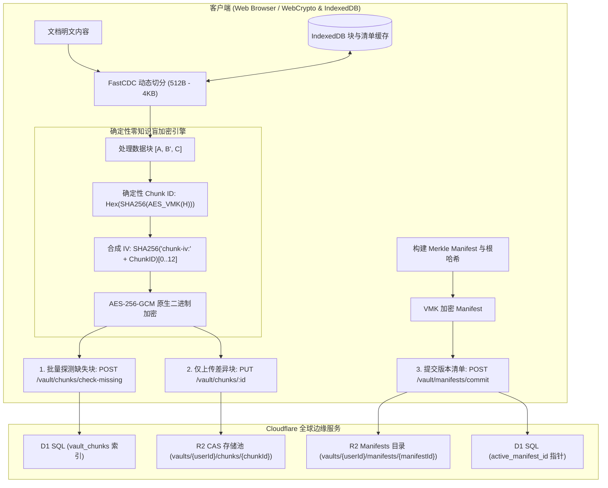

<div align="center">


# Markspace

**零信任 · 隐私优先 · 增量同步 · 边缘原生 Markdown 工作空间**

[](https://www.gnu.org/licenses/agpl-3.0)
[](https://www.typescriptlang.org/)
[](https://reactjs.org/)
[](https://vitejs.dev/)
[](https://workers.cloudflare.com/)
[](https://www.w3.org/TR/WebCryptoAPI/)

---

[English](README.md) | 简体中文 | [正體中文](README-zh-TW.md)

</div>

---

## 💡 何以 Markspace？

- **更完善的零知识隐私**：基于浏览器原生非导出 Web Crypto 密钥（`extractable: false`），明文与密钥不出客户端内存沙箱。
- **FastCDC 动态切分与 Merkle DAG 增量同步**：512B~4KB 内容感知微块同步，仅传输修改块（节省 >90% 带宽），提供不可篡改版本树与秒级回退。
- **多元第三方存储与零知识凭据**：支持第一方 Cloudflare R2、标准 S3 兼容存储、主流商业网盘（Google Drive / OneDrive / Dropbox / 阿里云盘 / 夸克网盘）及 WebDAV 协议，敏感凭证全量客户端 AES-256-GCM 零知识加密。
- **OPRF 盲化门禁与防重放安全**：NIST P-256 OPRF 盲校验凭据、RFC 9449 DPoP 设备绑定、挑战 Nonce 与 RFC 6238 TOTP 双重认证。
- **一体化工程与科学排版套件**：原生集成 KaTeX 公式引擎、Mermaid 动态图表 AST 与支持实时公式计算的可视化表格。
- **全球分布式边缘 Serverless 架构**：100% 部署于 Cloudflare 全球边缘网络（Workers + D1 + R2），零服务器运维负担，极速响应。

<p align="center">
  <a href="https://deploy.workers.cloudflare.com/?url=https://github.com/Obein/Markspace">
    
  </a>
</p>

---

### ⚖️ 核心架构与特性对比

| 评估维度 / 特性能力 | 传统云端笔记 (Notion, 印象笔记) | 本地文件 / Git 同步 (Obsidian + Git/Sync) | **Markspace** |
| :--- | :--- | :--- | :--- |
| **零知识隐私 (Zero-Knowledge)** | ❌ 服务端可明文检视所有笔记与附件 | ⚠️ 依赖插件；凭证与密钥多以明文存盘 | **✅ 更完善的零知识（Web Crypto 不可导出密钥）** |
| **同步粒度 (Sync Granularity)** | ⚠️ 全量 JSON 覆盖或专有 Delta 数据流 | ❌ Git 全量 Blob 重写或繁重的 commit 树 | **✅ FastCDC (512B–4KB) 内容感知微块同步** |
| **存储后端与云盘拓展** | ❌ 封闭私有云锁定 | ⚠️ 依赖本地文件或繁琐的第三方同步插件 | **✅ 原生 R2 + S3 兼容 + 商业网盘 + WebDAV 自由切换** |
| **传输与带宽利用率** | ❌ 每次修改均涉及较多冗余元数据与上传 | ⚠️ 小改动需生成并打包完整 Git objects | **✅ 节省 >90% 传输带宽（仅传输增量差异块）** |
| **版本控制与历史回退** | ⚠️ 云端托管快照；保留策略与隐私不透明 | ⚠️ 容易出现 Git 分支冲突与合并故障 | **✅ 加密 Merkle DAG 不可篡改时间线与秒级回退** |
| **凭证传输与认证安全** | ❌ 明文密码传输 / 服务端 Hash 存储 | ⚠️ 个人访问令牌 (PAT) 或 SSH Key 存盘 | **✅ WebAuthn FIDO2 Passkeys + NIST P-256 OPRF 盲校验 + TOTP** |
| **二进制媒体存储开销** | ⚠️ 常见 Base64 编码引入 33.3% 体积膨胀 | ❌ Git LFS 或大型二进制导致同步瓶颈 | **✅ 0% 额外开销 Raw Binary 原生二进制流** |
| **本地缓存与秒级重构** | ⚠️ 离线缓存受限 | ⚠️ `.git` 历史目录占用大量本地磁盘空间 | **✅ 浏览器 IndexedDB 微块缓存，亚毫秒还原** |
| **基础设施与部署成本** | ❌ 商业闭源锁定，数据无法完全掌控 | ⚠️ 需自建/维护 Git 伺服器或购买专有云 | **✅ 100% Serverless Cloudflare 边缘部署 (D1+R2)** |

---

## 📸 界面预览

<p align="center">
  
</p>
<p align="center">
  <em>Bento 零信任安全展台与登录门禁</em>
</p>

<table>
  <tr>
    <td width="50%" align="center">
      <br />
      <b>沉浸式编辑模式</b>
    </td>
    <td width="50%" align="center">
      <br />
      <b>独立预览模式</b>
    </td>
  </tr>
  <tr>
    <td width="50%" align="center">
      <br />
      <b>分列双栏 KaTeX 数学排版</b>
    </td>
    <td width="50%" align="center">
      <br />
      <b>分列双栏 Mermaid 动态图表</b>
    </td>
  </tr>
  <tr>
    <td width="50%" align="center">
      <br />
      <b>可视化电子表格编辑器</b>
    </td>
    <td width="50%" align="center">
      <br />
      <b>Merkle DAG 版本时光机与历史回退</b>
    </td>
  </tr>
</table>

---

## ✨ 核心特性

### 🧩 FastCDC 动态内容分块与差异增量同步
- **细粒度自适应切分**：采用 64-bit Gear-hash 滚动哈希自适应识别内容边界（`最小 512B`、`平均 1KB`、`最大 4KB`），彻底消除了固定分块带来的雪崩移位效应。
- **差异块增量同步**：保存时自动探测服务端缺失块，仅上传变更的 512B ~ 1KB 增量密文块与轻量 Manifest 清单，上行带宽节省 90%+。
- **IndexedDB 本地块缓存**：已解密的块与 Manifest 清单在浏览器本地 IndexedDB 中进行毫秒级缓存，历史版本检视与 Diff 对比 **0 网络请求极速重组**。

### 🗄️ 多元第三方存储支持与零知识凭据加密 (S3 / 商业网盘 / WebDAV)
- **多协议全生态存储接入**：
  - **第一方原生存储 (First-Party)**：默认 Cloudflare R2 对象存储，开箱即用；
  - **S3 兼容对象存储 (S3-Compatible)**：AWS S3、Cloudflare R2 (S3 API)、MinIO、阿里云 OSS、腾讯云 COS、Backblaze B2、Wasabi 及自定义 Endpoint / Path Style 支持；
  - **主流商业网盘 (Commercial Cloud Drive)**：Google Drive、Microsoft OneDrive、Dropbox、阿里云盘、夸克网盘；
  - **标准 WebDAV 协议 (WebDAV Protocol)**：坚果云 (Jianguoyun)、Nextcloud、ownCloud、Synology DSM 与自建 WebDAV 伺服器。
- **端到端零知识加密凭据存储 (Zero-Knowledge E2EE)**：
  - 存储凭证（如 Secret Access Key、WebDAV 密码、网盘 OAuth/API Token）在离开浏览器前使用客户端 **AES-256-GCM** 完成强加密；
  - 服务端与 D1 数据库仅保存高强度密文与 IV，服务端无从知晓明文凭证；
  - 登录新设备或切换浏览器时，后台自动从云端同步密文并在客户端本地解密还原。
- **实时连通性探测 (Real-Time Connectivity Probe)**：提供即时网络与凭证连通性测试，在保存并绑定前预先验证权限与连通状态。
- **无 R2 独立运行能力 (Smart Storage Fallback)**：系统智能感知后端环境是否绑定 R2 Bucket；在未关联第一方 R2 时，创建 Vault 自动前置引导并强制配置第三方存储方案，实现零 R2 强依赖下的完全独立运行。

### 🛡️ 确定性零知识盲块加密与 CAS 存储池
- **非可导出密钥安全执行**：使用 Web Crypto API 的不可导出密钥（`extractable: false`）执行原生 AES-256-GCM 运算，密钥不写入 LocalStorage 或磁盘介质，降低密钥持久化泄露风险。
- **Vault 内部盲去重**：通过私有 $VMK$ 派生确定性 Chunk ID（$H = \text{SHA-256}(Chunk)$ 经由 $VMK$ 加密），同一 Vault 内相同内容自动去重。
- **跨用户强加密隔离**：不同用户的私有 $VMK$ 完全隔离，相同明文生成截然不同的 Chunk ID 与密文，彻底免疫服务端的频次分析与字典攻击。
- **Raw Binary (0% 冗余) 存储**：彻底清除 Base64 编码带来的 33.3% 体积膨胀，原生采用 ArrayBuffer / Uint8Array 二进制流存储在 R2 中。

### 🌲 Merkle DAG 版本树与时间线回退
- **不可篡改版本清单**：每次保存均构建轻量加密 Manifest 记录有序 Chunk 拓扑并计算 Merkle Root Hash，形成不可篡改的 DAG 版本树。
- **点对点精确时间回滚**：支持任意历史版本的无损检视与一键回退，无需服务端重新构建整个文件。

### 🔑 硬件级 Passkeys (WebAuthn / FIDO2) 与 OPRF 灾难恢复
- **零知识硬件绑定 Passkeys**：全面支持 WebAuthn / FIDO2 硬件标准（Touch ID、Windows Hello、Face ID、YubiKey、Google 密码管理工具、Apple iCloud 钥匙串与 1Password），通过 WebAuthn PRF 确定性派生 256 位高熵 Passkey Vault Key (PVK)。
- **单用户多 Passkey 绑定与管理**：支持在个人中心集中查看、重命名与管理多个设备/硬件安全密钥。
- **NIST P-256 椭圆曲线 OPRF 灾难恢复盲化门禁**：客户端在传输前对助记词凭据进行盲化计算，服务端在不知晓明文的情况下完成校验，彻底抵御离线字典与撞库爆破。
- **8 词 BIP-39 助记词冷恢复**：创建 Vault 时生成标准 8 词助记词，全面支持空格与连字符（`-`）分词，提供极致离线容灾。
- **RFC 6238 TOTP 双重认证**：支持 30 秒动态令牌轮转，兼容主流身份验证器。
- **RFC 9449 DPoP 与 Nonce 熔断**：通过 6 字节挑战 Nonce 与设备令牌实时绑定，重放尝试立即触发熔断。

### 👤 用户政策、存储配额与闲置自动销毁
- **Unix 规范凭据**：用户名遵循 Unix 格式（`5–32` 字符，`/^[a-z_][a-z0-9_-]{4,31}$/`，仅限小写字母、数字、下划线与短横线，首字符为字母或下划线），系统内全局唯一；密码采用 Unix 格式（`12–128` 字符），不强制字符成分复杂度。
- **全局唯一 User UUID**：每位用户绑定唯一的 UUID 标识符，支持控制台一键快捷复制。
- **精细化存储配额管控 (1MB – 1TB)**：非管理员用户默认拥有 `10MB` 存储配额，系统管理员可按需在 `1MB` 到 `1TB` 区间内调整全局默认或指定用户配额，分块与文件写入执行硬上限拦截。
- **100 条审计日志保留上限**：每位用户的零信任安全与操作审计日志自动剪裁并最多保留最新 100 条记录，UI 显式声明。
- **闲置账户生命周期销毁机制**：非管理员用户最后在线时间超过闲置阈值（默认 `1 个月`，支持管理员配置 `1 个月` 至 `1 年`，亦可关闭）将自动由 Worker Cron 定时任务彻底级联销毁用户与其全部 Vault 数据，UI 关键节点显式声明备份与自部署提示。
- **系统管理员控制台**：支持系统管理员集中查看所有用户的 UUID、创建时间、最后在线时间、存储消耗、调整用户角色/配额，以及手动或定时触发闲置用户清理。

### 📊 交互式可视化表格编辑器
- **所见即所得表格网格**：在 Markdown 笔记中直接增删行列、调整对齐与单元格内容。
- **实时公式引擎**：内置数学计算引擎，支持 `SUM`、`AVG`、`COUNT`、`MIN`、`MAX`、`IF` 及基础算术表达式。
- **GFM 无损转换**：与标准 GitHub Flavored Markdown 表格语法无缝互转。

### 📐 科学与工程排版套件
- **KaTeX 数学公式引擎**：支持行内公式（`$...$`）与块级公式（`$$...$$`）的高性能渲染。
- **Mermaid 动态图表 AST**：直接根据代码块生成流程图、时序图、类图与甘特图。
- **Lezer 增量语法解析**：支持 Markdown、JavaScript、Python、CSS、HTML、JSON 等语言的高速语法高亮。

### 🌐 全要素国际化多语言 (i18n)
- 原生支持 8 种主流语言无缝切换：
  - 🇨🇳 简体中文 (`zh-CN`) | 🇭🇰/🇹🇼 正體中文 (`zh-TW`) | 🇺🇸 English (`en-US`) | 🇯🇵 日本語 (`ja-JP`)
  - 🇰🇷 한국어 (`ko-KR`) | 🇩🇪 Deutsch (`de-DE`) | 🇪🇸 Español (`es-ES`) | 🇻🇳 Tiếng Việt (`vi-VN`)

### 🎨 OLED 纯黑美学与排版
- 针对纯黑 OLED 背景（`#050507`）调校的高对比度视觉体验。
- 深度集成 **GitHub Monaspace Neon** 代码等宽字体与 **Noto 全语言多文种字族**。

---

## 🏗️ 架构与存储拓扑



---

## 🚀 快速上手

### 环境准备
- [Node.js](https://nodejs.org/) (v18.0.0 或更高版本)
- [npm](https://www.npmjs.com/) (v9.0.0 或更高版本) 或 [pnpm](https://pnpm.io/)
- [Cloudflare Wrangler CLI](https://developers.cloudflare.com/workers/wrangler/)

### 1. 克隆并安装依赖
```bash
git clone https://github.com/your-username/markspace.git
cd markspace
npm install
```

### 2. 本地数据库迁移 (Cloudflare D1)
```bash
npm run d1:migrate:local
```

### 3. 启动开发服务器
```bash
# 终端 1：启动边缘 API 后端
npm run dev:api

# 终端 2：启动前端 UI 开发服务器
npm run dev:ui
```
在浏览器中打开 `http://localhost:5173` 即可开始使用。

---

## 🚢 部署发布

> [!IMPORTANT]
> **构建环境说明（Rust to WebAssembly）**：  
> 本项目的零信任内存擦除模块依赖 Rust 编译环境。由于 **Cloudflare Dashboard 控制台的默认构建容器未预装 Rust / Cargo 工具链**，线上全自动构建与发布**仅采用 GitHub Actions (`build-and-deploy.yml`)**（或通过本地终端 CLI 部署）。请避免在 Cloudflare 控制台直接开启 Git 自动构建，以免因缺少 Cargo 报错。

### 🌐 方式一：GitHub Actions 自动化全流程部署 (推荐)

项目已内置自动化 CI/CD 流水线 [`.github/workflows/build-and-deploy.yml`](.github/workflows/build-and-deploy.yml)。当代码合并或推送到 `main` 分支时，GitHub Actions 会自动在具备完整 Rust + Node.js 环境的 Runner 中按序完成：**Rust WASM 编译 $\rightarrow$ 类型校验 $\rightarrow$ 前端打包 $\rightarrow$ D1 生产数据库表结构迁移 $\rightarrow$ Cloudflare Workers 边缘网络发布**。

#### 1. 配置 Cloudflare 部署鉴权 (GitHub 仓库机密)

进入 GitHub 仓库页面 $\rightarrow$ **Settings** $\rightarrow$ **Secrets and variables** $\rightarrow$ **Actions** $\rightarrow$ 点击 **New repository secret** 添加以下机密：

| 机密名称 (Secret Name) | 是否必填 | 说明与获取方式 |
| :--- | :--- | :--- |
| `CLOUDFLARE_API_TOKEN` | **必填** | 具备 Cloudflare Workers、D1 与 Pages 部署权限的 API Token（在 [Cloudflare API Tokens](https://dash.cloudflare.com/profile/api-tokens) 中创建，选择 **Edit Cloudflare Workers** 模板） |
| `CLOUDFLARE_ACCOUNT_ID` | 可选 | 您的 Cloudflare 账户 ID（可在 Workers 控制台右侧侧边栏获取） |

> [!NOTE]
> 官方 **[Cloudflare Workers and Pages GitHub App](https://github.com/apps/cloudflare-workers-and-pages)** 仅供 Cloudflare Dashboard 后台原生 Git 构建使用，**不会向 GitHub Actions 虚拟机注入凭据**。因此在 GitHub Actions CI/CD 中部署时，必须在仓库设置中配置 `CLOUDFLARE_API_TOKEN` 机密。

#### 2. 自动触发上线
- 提交或合并代码至 `main` 分支，GitHub Actions 将自动执行 **`Rust WASM Build & Deploy`** 流水线并完成全量部署上线；
- 支持在 GitHub 仓库的 **Actions** 选项卡手动点击 **Run workflow** 触发部署。

#### 3. 环境变量与生产机密设置 (Variables and Secrets)
在 **Cloudflare 控制台** $\rightarrow$ **Workers 和 Pages** $\rightarrow$ `markspace` $\rightarrow$ **设置 (Settings)** $\rightarrow$ **变量和机密 (Variables and Secrets)** 中配置运行期凭据：

| 名称 (Name) | 类型 (Type) | 说明 (Description) | 生成命令/示例 |
| :--- | :--- | :--- | :--- |
| `JWT_SECRET` | **机密 (Secret / 加密)** | 用户会话 JWT 鉴权签名密钥（要求 ≥30 字符高熵字符串，经 SHA-256 派生） | `openssl rand -base64 32` (或密码生成器随机字符串) |
| `MASTER_ENCRYPTION_KEY` | **机密 (Secret / 加密)** | 独立/历史主加密密钥（要求 ≥30 字符，默认作为 `v0` 版本） | `openssl rand -base64 32` |
| `MASTER_ENCRYPTION_KEYS` | **机密 (Secret / 加密)** | 多版本密钥轮换 JSON 映射（例如 `{"1":"k1...","2":"k2..."}`） | 扁平 JSON 映射（每项密钥 ≥30 字符），系统自动采用最大数字版本作为最新加密密钥 |
| `ENVIRONMENT` | **变量 (Variable / 明文)** | 运行环境标识 | `production` |

> [!TIP]
> **零停机密钥轮换 (KEK Rotation)**：  
> Markspace 支持在零停机、无感知的状态下轮换主加密密钥（Key Encryption Key）：  
> 1. 配置 `MASTER_ENCRYPTION_KEYS` 为 JSON 格式的版本映射（例如：`{"1": "first-secret-at-least-30-chars...", "2": "second-secret-at-least-30-chars..."}`）。  
> 2. 每个密钥仅需满足长度 ≥30 字符，系统会自动通过 SHA-256 散列函数派生出标准的 256 位加密密钥。  
> 3. 系统会自动选择版本号最大的密钥作为当前最新密钥用于新密文加密。  
> 4. 历史密文（包括由 `MASTER_ENCRYPTION_KEY` 加密的 `v0` 数据）在用户下次登录时通过对应版本解密，并通过**惰性重新加密 (Lazy Re-encryption)** 无缝升级至最新版本密钥。

---

### 💻 方式二：本地 CLI 命令行部署 (Cloudflare Wrangler)

若您本地已安装 Rust/Cargo 与 Node.js 环境，可直接使用项目集成的 NPM 脚本一键配置并发布：

```bash
# 1. 首次创建生产 D1 数据库与 R2 存储桶 (开箱初始化)
npm run d1:create
npm run r2:create

# 2. 设置生产机密密钥 (首次部署配置)
npx wrangler secret put JWT_SECRET
npx wrangler secret put MASTER_ENCRYPTION_KEY

# 3. 本地构建验证 (编译 Rust WASM 与打包前端)
npm run build

# 4. 一键部署上线 (串联 WASM 编译、前端打包、D1 远程迁移与 Worker 部署)
npm run deploy
```

---

## 🛠️ 技术栈清单

| 层次 | 核心技术 |
| :--- | :--- |
| **前端框架** | React 18, TypeScript, Vite |
| **样式与设计** | Tailwind CSS, Lucide React, Monaspace Neon |
| **文档处理** | Marked, Lezer AST, KaTeX, Mermaid.js |
| **分块与版本控制** | FastCDC (Gear-Hash), Merkle DAG, IndexedDB Local Cache |
| **密码学套件** | Web Crypto API (SubtleCrypto, 非导出密钥), AES-256-GCM, OPRF NIST P-256, DPoP RFC 9449 |
| **边缘计算与存储** | Cloudflare Workers, Cloudflare D1 SQL, Cloudflare R2 CAS 对象存储 |
| **Monorepo 工具链** | npm workspaces, TypeScript Project References |

---

## 📄 开源许可证

本项目采用 **GNU Affero General Public License v3.0 (AGPLv3)** 开源许可证。  
详细信息请参阅 [LICENSE](LICENSE) 文件。
