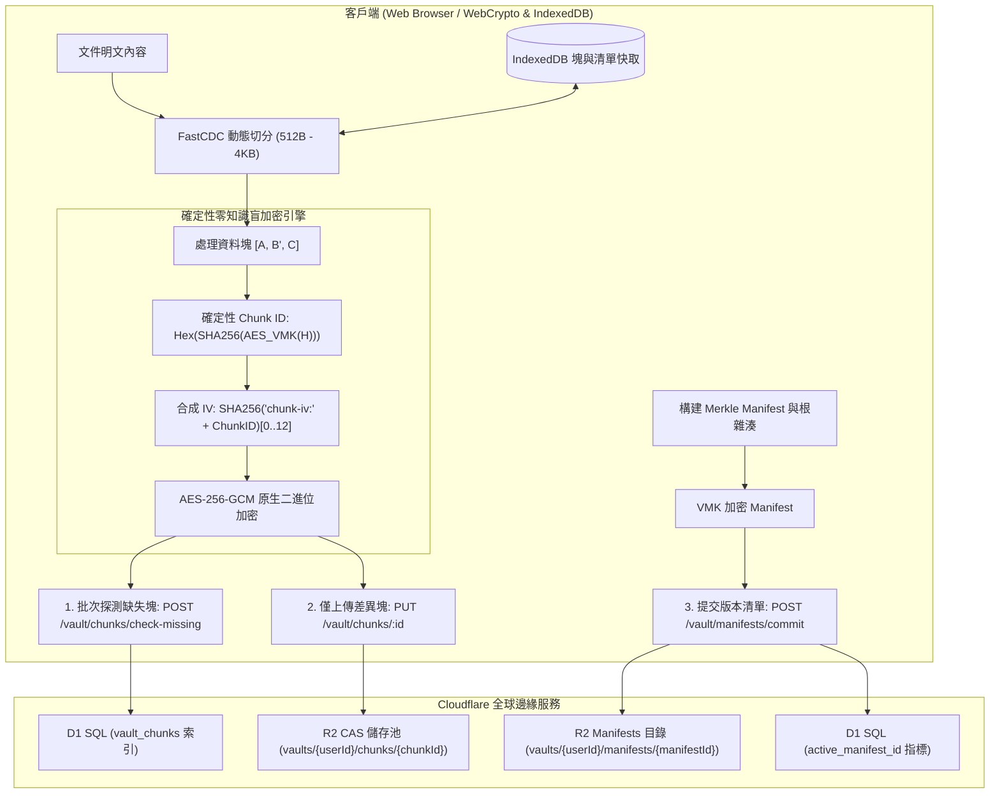

<div align="center">


# Markspace

**零信任 · 隐私优先 · 增量同步 · 边缘原生 Markdown 工作空间**

[](https://www.gnu.org/licenses/agpl-3.0)
[](https://www.typescriptlang.org/)
[](https://reactjs.org/)
[](https://vitejs.dev/)
[](https://workers.cloudflare.com/)
[](https://www.w3.org/TR/WebCryptoAPI/)

---

[English](README.md) | [简体中文](README-zh-CN.md) | 正體中文

</div>

---

## 💡 何以 Markspace？

- **更完善的零知識隱私**：基於瀏覽器原生非導出 Web Crypto 金鑰（`extractable: false`），明文與金鑰不出客戶端記憶體沙箱。
- **FastCDC 動態切分與 Merkle DAG 增量同步**：512B~4KB 內容感知微塊同步，僅傳輸修改塊（節省 >90% 頻寬），提供不可篡改版本樹與秒級回退。
- **多元第三方儲存與零知識憑證**：支援第一方 Cloudflare R2、標準 S3 相容儲存、主流商業網盤（Google Drive / OneDrive / Dropbox / 阿里雲盤 / 誇克網盤）及 WebDAV 協定，敏感憑據全量客戶端 AES-256-GCM 零知識加密。
- **OPRF 盲化門禁與防重放安全**：NIST P-256 OPRF 盲校驗憑據、RFC 9449 DPoP 設備綁定、挑戰 Nonce 與 RFC 6238 TOTP 雙重認證。
- **一體化工程與科學排版套件**：原生整合 KaTeX 公式引擎、Mermaid 動態圖表 AST 與支援即時公式計算的可視化表格。
- **全球分散式邊緣 Serverless 架構**：100% 部署於 Cloudflare 全球邊緣網路（Workers + D1 + R2），零伺服器維運負擔，極速回應。

<p align="center">
  <a href="https://deploy.workers.cloudflare.com/?url=https://github.com/Obein/Markspace">
    
  </a>
</p>

---

### ⚖️ 核心架構與特性對比

| 評估維度 / 特性能力 | 傳統雲端筆記 (Notion, 印象筆記) | 本機檔案 / Git 同步 (Obsidian + Git/Sync) | **Markspace** |
| :--- | :--- | :--- | :--- |
| **零知識隱私 (Zero-Knowledge)** | ❌ 伺服端可明文檢視所有筆記與附件 | ⚠️ 依賴外掛；憑據與金鑰多以明文存盤 | **✅ 更完善的零知識（Web Crypto 不可導出金鑰）** |
| **同步粒度 (Sync Granularity)** | ⚠️ 全量 JSON 覆蓋或專有 Delta 數據流 | ❌ Git 全量 Blob 重寫或繁重的 commit 樹 | **✅ FastCDC (512B–4KB) 內容感知微塊同步** |
| **儲存後端與網盤拓展** | ❌ 封閉私有雲鎖定 | ⚠️ 依賴本機檔案或繁瑣的第三方同步外掛 | **✅ 原生 R2 + S3 相容 + 商業網盤 + WebDAV 自由切換** |
| **傳輸與頻寬利用率** | ❌ 每次修改均涉及較多冗餘元數據與上傳 | ⚠️ 小改動需生成並打包完整 Git objects | **✅ 節省 >90% 傳輸頻寬（僅傳輸增量差異塊）** |
| **版本控制與歷史回退** | ⚠️ 雲端託管快照；保留策略與隱私不透明 | ⚠️ 容易出現 Git 分支衝突與合併故障 | **✅ 加密 Merkle DAG 不可篡改時間線與秒級回退** |
| **憑證傳輸與認證安全** | ❌ 明文密碼傳輸 / 伺服端 Hash 儲存 | ⚠️ 個人訪問權杖 (PAT) 或 SSH Key 存盤 | **✅ WebAuthn FIDO2 Passkeys + NIST P-256 OPRF 盲校驗 + TOTP** |
| **二進位媒體儲存開銷** | ⚠️ 常見 Base64 編碼引入 33.3% 體積膨脹 | ❌ Git LFS 或大型二進位導致同步瓶頸 | **✅ 0% 額外開銷 Raw Binary 原生二進位流** |
| **本機快取與秒級重構** | ⚠️ 離線快取受限 | ⚠️ `.git` 歷史目錄占用大量本機磁碟空間 | **✅ 瀏覽器 IndexedDB 微塊快取，亞毫秒還原** |
| **基礎設施與部署成本** | ❌ 商業閉源鎖定，數據無法完全掌控 | ⚠️ 需自建/維護 Git 伺服器或購買專有雲 | **✅ 100% Serverless Cloudflare 邊緣部署 (D1+R2)** |

---

## 📸 介面預覽

<p align="center">
  
</p>
<p align="center">
  <em>Bento 零信任安全展台與登入門禁</em>
</p>

<table>
  <tr>
    <td width="50%" align="center">
      <br />
      <b>沉浸式編輯模式</b>
    </td>
    <td width="50%" align="center">
      <br />
      <b>獨立預覽模式</b>
    </td>
  </tr>
  <tr>
    <td width="50%" align="center">
      <br />
      <b>分列雙欄 KaTeX 數學排版</b>
    </td>
    <td width="50%" align="center">
      <br />
      <b>分列雙欄 Mermaid 動態圖表</b>
    </td>
  </tr>
  <tr>
    <td width="50%" align="center">
      <br />
      <b>視覺化電子試算表編輯器</b>
    </td>
    <td width="50%" align="center">
      <br />
      <b>Merkle DAG 版本時光機與歷史回退</b>
    </td>
  </tr>
</table>

---

## ✨ 核心特性

### 🧩 FastCDC 動態內容分塊與差異增量同步
- **細粒度自適應切分**：採用 64-bit Gear-hash 滾動雜湊自適應識別內容邊界（`最小 512B`、`平均 1KB`、`最大 4KB`），徹底消除了固定分塊帶來的雪崩移位效應。
- **差異塊增量同步**：儲存時自動探測伺服端缺失塊，僅上傳變更的 512B ~ 1KB 增量密文塊與輕量 Manifest 清單，上行頻寬節省 90%+。
- **IndexedDB 本機塊快取**：已解密的塊與 Manifest 清單在瀏覽器本機 IndexedDB 中進行毫秒級快取，歷史版本檢視與 Diff 對比 **0 網路請求極速重組**。

### 🗄️ 多元第三方儲存支援與零知識憑證加密 (S3 / 商業網盤 / WebDAV)
- **多協定全生態儲存接入**：
  - **第一方原生儲存 (First-Party)**：預設 Cloudflare R2 物件儲存，開箱即用；
  - **S3 相容物件儲存 (S3-Compatible)**：AWS S3、Cloudflare R2 (S3 API)、MinIO、阿里雲 OSS、騰訊雲 COS、Backblaze B2、Wasabi 及自訂 Endpoint / Path Style 支援；
  - **主流商業網盤 (Commercial Cloud Drive)**：Google Drive、Microsoft OneDrive、Dropbox、阿里雲盤、誇克網盤；
  - **標準 WebDAV 協定 (WebDAV Protocol)**：堅果雲 (Jianguoyun)、Nextcloud、ownCloud、Synology DSM 與自建 WebDAV 伺服器。
- **端到端零知識加密憑證儲存 (Zero-Knowledge E2EE)**：
  - 儲存憑證（如 Secret Access Key、WebDAV 密碼、網盤 OAuth/API Token）在離開瀏覽器前使用客戶端 **AES-256-GCM** 完成強加密；
  - 伺服端與 D1 資料庫僅保存高強度密文與 IV，伺服端無從知曉明文憑證；
  - 登入新裝置或切換瀏覽器時，後台自動從雲端同步密文並在客戶端本機解密還原。
- **即時連通性探針 (Real-Time Connectivity Probe)**：提供即時網路與憑證連通性測試，在儲存並綁定前預先驗證權限與連通狀態。
- **無 R2 獨立運行能力 (Smart Storage Fallback)**：系統智慧感知後端環境是否綁定 R2 Bucket；在未關聯第一方 R2 時，建立 Vault 自動前置引導並強制設定第三方儲存方案，實現零 R2 強依賴下的完全獨立運行。

### 🛡️ 確定性零知識盲塊加密與 CAS 儲存池
- **非可匯出金鑰安全執行**：使用 Web Crypto API 的不可匯出金鑰（`extractable: false`）執行原生 AES-256-GCM 運算，金鑰不寫入 LocalStorage 或磁碟介質，降低金鑰持久化洩漏風險。
- **Vault 內部盲去重**：透過私有 $VMK$ 派生確定性 Chunk ID（$H = \text{SHA-256}(Chunk)$ 經由 $VMK$ 加密），同一 Vault 內相同內容自動去重。
- **跨使用者強加密隔離**：不同使用者的私有 $VMK$ 完全隔離，相同明文生成截然不同的 Chunk ID 與密文，徹底免疫伺服端的頻次分析與字典攻擊。
- **Raw Binary (0% 冗餘) 儲存**：徹底清除 Base64 編碼帶來的 33.3% 體積膨脹，原生採用 ArrayBuffer / Uint8Array 二進位流儲存在 R2 中。

### 🌲 Merkle DAG 版本樹與時間線回退
- **不可篡改版本清单**：每次保存均构建轻量加密 Manifest 记录有序 Chunk 拓扑并计算 Merkle Root Hash，形成不可篡改的 DAG 版本树。
- **点对点精确时间回滚**：支持任意历史版本的无损检视与一键回退，无需服务端重新构建整个文件。

### 🔑 硬體級 Passkeys (WebAuthn / FIDO2) 與 OPRF 災難恢復
- **零知識硬體綁定 Passkeys**：全面支援 WebAuthn / FIDO2 硬體標準（Touch ID、Windows Hello、Face ID、YubiKey、Google 密碼管理工具、Apple iCloud 鑰匙圈與 1Password），透過 WebAuthn PRF 確定性派生 256 位高熵 Passkey Vault Key (PVK)。
- **單一使用者多 Passkey 綁定與管理**：支援在個人中心集中檢視、重新命名與管理多個裝置/硬體安全金鑰。
- **NIST P-256 橢圓曲線 OPRF 災難恢復盲化門禁**：客戶端在傳輸前對助記詞憑據進行盲化計算，伺服端在不知曉明文的情況下完成校驗，徹底抵禦離線字典與撞庫爆破。
- **8 詞 BIP-39 助記詞冷恢復**：建立 Vault 時生成標準 8 詞助記詞，全面支援空格與連字號（`-`）分詞，提供極致離線容災。
- **RFC 6238 TOTP 雙重認證**：支援 30 秒動態權杖輪轉，相容主流身分驗證器。
- **RFC 9449 DPoP 與 Nonce 熔斷**：透過 6 位元組挑戰 Nonce 與裝置權杖即時綁定，重放嘗試立即觸發熔斷。

### 👤 使用者政策、儲存配額與閒置自動銷毀
- **Unix 規範憑據**：使用者名稱遵循 Unix 格式（`5–32` 字元，`/^[a-z_][a-z0-9_-]{4,31}$/`，僅限小寫字母、數字、底線與短橫線，首字元為字母或底線），系統內全域唯一；密碼採用 Unix 格式（`12–128` 字元），不強制字元成分複雜度。
- **全域唯一 User UUID**：每位使用者綁定唯一的 UUID 識別碼，支援主控台一鍵快捷複製。
- **精細化儲存配額管控 (1MB – 1TB)**：非管理員使用者預設擁有 `10MB` 儲存配額，系統管理員可按需在 `1MB` 到 `1TB` 區間內調整全域預設或指定使用者配額，分塊與檔案寫入執行硬上限攔截。
- **100 條稽核日誌保留上限**：每位使用者的零信任安全與操作稽核日誌自動剪裁並最多保留最新 100 條記錄，UI 顯式宣告。
- **閒置帳戶生命週期銷毀機制**：非管理員使用者最後上線時間超過閒置閾值（預設 `1 個月`，支援管理員設定 `1 個月` 至 `1 年`，亦可關閉）將自動由 Worker Cron 排程任務徹底串聯銷毀使用者與其全部 Vault 數據，UI 關鍵節點顯式宣告備份與自部署提示。
- **系統管理員主控台**：支援系統管理員集中檢視所有使用者的 UUID、建立時間、最後上線時間、儲存消耗、調整使用者角色/配額，以及手動或排程觸發閒置使用者清理。

### 📊 互動式視覺化表格編輯器
- **所見即所得表格網格**：在 Markdown 筆記中直接增刪行列、調整對齊與儲存格內容。
- **即時公式引擎**：內建數學計算引擎，支援 `SUM`、`AVG`、`COUNT`、`MIN`、`MAX`、`IF` 及基礎算術表達式。
- **GFM 無損轉換**：與標準 GitHub Flavored Markdown 表格語法無縫互轉。

### 📐 科學與工程排版套件
- **KaTeX 數學公式引擎**：支援行內公式（`$...$`）與區塊公式（`$$...$$`）的高性能渲染。
- **Mermaid 動態圖表 AST**：直接根據程式碼區塊生成流程圖、循序圖、類別圖與甘特圖。
- **Lezer 增量語法解析**：支援 Markdown、JavaScript、Python、CSS、HTML、JSON 等語言的高速語法突顯。

### 🌐 全要素國際化多語言 (i18n)
- 原生支援 8 種主流語言無縫切換：
  - 🇨🇳 簡體中文 (`zh-CN`) | 🇭🇰/🇹🇼 正體中文 (`zh-TW`) | 🇺🇸 English (`en-US`) | 🇯🇵 日本語 (`ja-JP`)
  - 🇰🇷 한국어 (`ko-KR`) | 🇩🇪 Deutsch (`de-DE`) | 🇪🇸 Español (`es-ES`) | 🇻🇳 Tiếng Việt (`vi-VN`)

### 🎨 OLED 純黑美學與排版
- 針對純黑 OLED 背景（`#050507`）調校的高對比視覺體驗。
- 深度整合 **GitHub Monaspace Neon** 程式碼等寬字型與 **Noto 全語言多文種字族**。

---

## 🏗️ 架構與儲存拓撲



---

## 🚀 快速上手

### 環境準備
- [Node.js](https://nodejs.org/) (v18.0.0 或更高版本)
- [npm](https://www.npmjs.com/) (v9.0.0 或更高版本) 或 [pnpm](https://pnpm.io/)
- [Cloudflare Wrangler CLI](https://developers.cloudflare.com/workers/wrangler/)

### 1. 複製並安裝依賴
```bash
git clone https://github.com/your-username/markspace.git
cd markspace
npm install
```

### 2. 本地資料庫遷移 (Cloudflare D1)
```bash
npm run d1:migrate:local
```

### 3. 啟動開發伺服器
```bash
# 終端機 1：啟動邊緣 API 後端
npm run dev:api

# 終端機 2：啟動前端 UI 開發伺服器
npm run dev:ui
```
在瀏覽器中打開 `http://localhost:5173` 即可開始使用。

---

## 🚢 部署發布

> [!IMPORTANT]
> **建置環境說明（Rust to WebAssembly）**：  
> 本專案的零信任記憶體抹除模組依賴 Rust 編譯環境。由於 **Cloudflare Dashboard 主控台的預設建置容器未預裝 Rust / Cargo 工具鏈**，線上全自動建置與發布**僅採用 GitHub Actions (`build-and-deploy.yml`)**（或透過本地終端機 CLI 部署）。請避免在 Cloudflare 主控台直接開啟 Git 自動建置，以免因缺少 Cargo 報錯。

### 🌐 方式一：GitHub Actions 自動化全流程部署 (推薦)

專案已內建自動化 CI/CD 流水線 [`.github/workflows/build-and-deploy.yml`](.github/workflows/build-and-deploy.yml)。當程式碼合併或推送到 `main` 分支時，GitHub Actions 會自動在具備完整 Rust + Node.js 環境的 Runner 中循序完成：**Rust WASM 編譯 $\rightarrow$ 型別檢查 $\rightarrow$ 前端打包 $\rightarrow$ D1 生產資料庫綱要遷移 $\rightarrow$ Cloudflare Workers 邊緣網路發布**。

#### 1. 設定 Cloudflare 部署鑑權 (GitHub 存放庫機密)

進入 GitHub 存放庫頁面 $\rightarrow$ **Settings** $\rightarrow$ **Secrets and variables** $\rightarrow$ **Actions** $\rightarrow$ 點選 **New repository secret** 新增以下機密：

| 機密名稱 (Secret Name) | 是否必填 | 說明與取得方式 |
| :--- | :--- | :--- |
| `CLOUDFLARE_API_TOKEN` | **必填** | 具備 Cloudflare Workers、D1 與 Pages 部署權限的 API Token（在 [Cloudflare API Tokens](https://dash.cloudflare.com/profile/api-tokens) 中建立，選擇 **Edit Cloudflare Workers** 範本） |
| `CLOUDFLARE_ACCOUNT_ID` | 選填 | 您的 Cloudflare 帳戶 ID（可在 Workers 主控台右側側邊欄取得） |

> [!NOTE]
> 官方 **[Cloudflare Workers and Pages GitHub App](https://github.com/apps/cloudflare-workers-and-pages)** 僅供 Cloudflare Dashboard 主控台原生 Git 建置使用，**不會向 GitHub Actions 虛擬機注入憑證**。因此在 GitHub Actions CI/CD 中部署時，必須在存放庫設定中配置 `CLOUDFLARE_API_TOKEN` 機密。

#### 2. 自動觸發上線
- 提交或合併程式碼至 `main` 分支，GitHub Actions 將自動執行 **`Rust WASM Build & Deploy`** 流水線並完成全量部署上線；
- 亦可在 GitHub 存放庫的 **Actions** 索引標籤手動點選 **Run workflow** 觸發部署。

#### 3. 環境變數與機密金鑰設定 (Variables and Secrets)
在 **Cloudflare 主控台** $\rightarrow$ **Workers 和 Pages** $\rightarrow$ `markspace` $\rightarrow$ **設定 (Settings)** $\rightarrow$ **變數與機密 (Variables and Secrets)** 中設定運行期憑證：

| 名稱 (Name) | 類型 (Type) | 說明 (Description) | 產生命令/範例 |
| :--- | :--- | :--- | :--- |
| `JWT_SECRET` | **機密 (Secret / 加密)** | 使用者工作階段 JWT 鑑權簽章金鑰（建議 ≥32 字元高熵字串） | `openssl rand -base64 32` (或密碼產生器隨機字串) |
| `MASTER_ENCRYPTION_KEY` | **機密 (Secret / 加密)** | 獨立/歷史主加密金鑰（要求 ≥30 字元，預設作為 `v0` 版本） | `openssl rand -base64 32` |
| `MASTER_ENCRYPTION_KEYS` | **機密 (Secret / 加密)** | 多版本金鑰輪換 JSON 映射（例如 `{"1":"k1...","2":"k2..."}`） | 扁平 JSON 映射（每項金鑰 ≥30 字元），系統自動採用最大數字版本作為最新加密金鑰 |
| `ENVIRONMENT` | **變數 (Variable / 明文)** | 運行環境識別標記 | `production` |

> [!TIP]
> **零停機金鑰輪換 (KEK Rotation)**：  
> Markspace 支援在零停機、無感知的狀態下輪換主加密金鑰（Key Encryption Key）：  
> 1. 設定 `MASTER_ENCRYPTION_KEYS` 為 JSON 格式的版本映射（例如：`{"1": "first-secret-at-least-30-chars...", "2": "second-secret-at-least-30-chars..."}`）。  
> 2. 每個金鑰僅需滿足長度 ≥30 字元，系統會自動透過 SHA-256 雜湊函數衍生出標準的 256 位元加密金鑰。  
> 3. 系統會自動選擇版本號最大的金鑰作為當前最新金鑰用於新密文加密。  
> 4. 歷史密文（包括由 `MASTER_ENCRYPTION_KEY` 加密的 `v0` 資料）在使用者下次登入時透過對應版本解密，並透過**惰性重新加密 (Lazy Re-encryption)** 無縫升級至最新版本金鑰。

---

### 💻 方式二：本地 CLI 命令列部署 (Cloudflare Wrangler)

若您本地已安裝 Rust/Cargo 與 Node.js 環境，可直接使用專案整合的 NPM 腳本一鍵設定並發布：

```bash
# 1. 首次建立生產 D1 資料庫與 R2 儲存貯體 (開箱初始化)
npm run d1:create
npm run r2:create

# 2. 設定生產機密金鑰 (首次部署設定)
npx wrangler secret put JWT_SECRET
npx wrangler secret put MASTER_ENCRYPTION_KEY

# 3. 本地建置驗證 (編譯 Rust WASM 與打包前端)
npm run build

# 4. 一鍵部署上線 (串聯 WASM 編譯、前端打包、D1 遠端遷移與 Worker 部署)
npm run deploy
```

---

## 🛠️ 技術棧清單

| 層次 | 核心技術 |
| :--- | :--- |
| **前端框架** | React 18, TypeScript, Vite |
| **樣式與設計** | Tailwind CSS, Lucide React, Monaspace Neon |
| **文件處理** | Marked, Lezer AST, KaTeX, Mermaid.js |
| **分塊與版本控制** | FastCDC (Gear-Hash), Merkle DAG, IndexedDB Local Cache |
| **密碼學套件** | Web Crypto API (SubtleCrypto, 非導出金鑰), AES-256-GCM, OPRF NIST P-256, DPoP RFC 9449 |
| **邊緣計算與儲存** | Cloudflare Workers, Cloudflare D1 SQL, Cloudflare R2 CAS 物件儲存 |
| **Monorepo 工具鏈** | npm workspaces, TypeScript Project References |

---

## 📄 開源許可證

本專案採用 **GNU Affero General Public License v3.0 (AGPLv3)** 開源許可證。  
詳細資訊請參閱 [LICENSE](LICENSE) 檔案。

