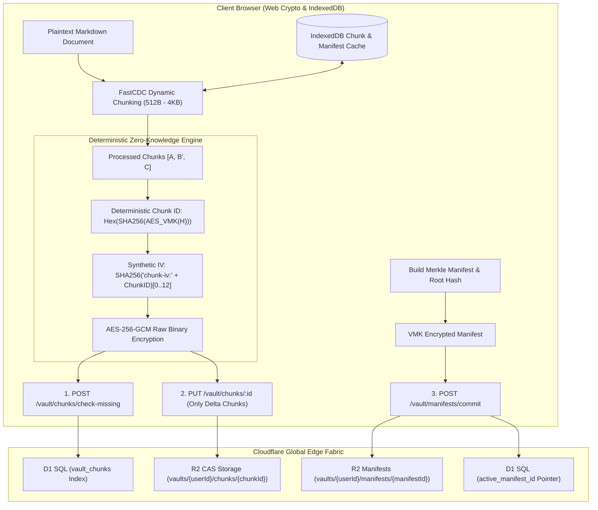

<div align="center">


# Markspace

**A Zero-Trust, Privacy-First, Incremental Synchronization, Edge-Native Markdown Workspace**

[](https://www.gnu.org/licenses/agpl-3.0)
[](https://www.typescriptlang.org/)
[](https://reactjs.org/)
[](https://vitejs.dev/)
[](https://workers.cloudflare.com/)
[](https://www.w3.org/TR/WebCryptoAPI/)

---

English | [简体中文](README-zh-CN.md) | [正體中文](README-zh-TW.md)

</div>

---

## 💡 Why Markspace?

- **More Robust Zero-Knowledge Privacy**: End-to-end envelope encryption via non-extractable Web Crypto keys (`extractable: false`), ensuring plaintext never leaves client memory unencrypted.
- **FastCDC & Merkle DAG Block Sync**: Fine-grained content-defined chunking (`512B – 4KB`) transferring only modified blocks alongside immutable Merkle version trees.
- **Multi-Tier Third-Party Storage & Zero-Knowledge Credentials**: Native Cloudflare R2, standard S3-compatible storage, commercial cloud drives (Google Drive / OneDrive / Dropbox / Aliyun / Quark), and WebDAV protocols, with all credentials encrypted via client-side AES-256-GCM.
- **OPRF Blind Gate & Zero-Replay Security**: NIST P-256 OPRF oblivious credential evaluation, RFC 9449 DPoP device token binding, and RFC 6238 TOTP.
- **Integrated Scientific & Engineering Workspace**: Hardware-accelerated KaTeX typesetting, dynamic Mermaid AST diagrams, and WYSIWYG spreadsheet table editor.
- **Edge-Native Serverless Architecture**: 100% serverless deployment on Cloudflare global edge fabric (Workers + D1 + R2) with zero maintenance.

<p align="center">
  <a href="https://deploy.workers.cloudflare.com/?url=https://github.com/Obein/Markspace">
    
  </a>
</p>

---

### ⚖️ Architectural Comparison

| Dimension / Capability | Traditional Cloud Notes (Notion, Evernote) | File / Git Sync Notes (Obsidian + Git / Sync) | **Markspace** |
| :--- | :--- | :--- | :--- |
| **Zero-Knowledge Privacy** | ❌ Server can read all notes & attachments | ⚠️ Relies on plugins; keys often stored on disk | **✅ Robust Zero-Knowledge (Non-extractable Web Crypto AES-256-GCM)** |
| **Sync Granularity** | ⚠️ Monolithic JSON or proprietary delta stream | ❌ Full-file Git blob rewrite or heavy commit trees | **✅ FastCDC (512B–4KB) Content-Defined CAS Chunking** |
| **Storage Backends & Cloud Drive** | ❌ Closed proprietary cloud lock-in | ⚠️ Local-only or clunky third-party sync plugins | **✅ Native R2 + S3-Compatible + Commercial Drives + WebDAV** |
| **Bandwidth Efficiency** | ❌ High overhead with metadata/asset re-uploads | ⚠️ Git object packing overhead on small changes | **✅ >90% bandwidth saved (only delta chunks uploaded)** |
| **Version History & Rollback** | ⚠️ Cloud-managed snapshots; opaque retention | ⚠️ Git merge conflicts & branch divergence | **✅ Cryptographic Merkle DAG Immutable Version Tree** |
| **Credential & Passkey Security** | ❌ Plaintext password / server-side hash | ⚠️ Basic PAT / SSH keys stored in plaintext | **✅ WebAuthn FIDO2 Passkeys + NIST P-256 OPRF Blind Gate + TOTP** |
| **Storage & Transfer Overhead** | ⚠️ Base64 encoding inflates data by 33.3% | ❌ Git LFS / large binary sync bottleneck | **✅ 0% Overhead Raw Binary (`application/octet-stream`)** |
| **Local Cache & Reconstruction** | ⚠️ Limited offline caching | ⚠️ Heavy disk footprint with `.git` histories | **✅ IndexedDB client-side sub-millisecond block cache** |
| **Infrastructure & Deployment** | ❌ Proprietary closed-source vendor lock-in | ⚠️ Self-managed Git server / VPS maintenance | **✅ 100% Serverless Cloudflare Global Edge (Workers + D1 + R2)** |

---

## 📸 Quick Look

<p align="center">
  
</p>
<p align="center">
  <em>Bento Authentication & Zero-Trust Security Portal</em>
</p>

<table>
  <tr>
    <td width="50%" align="center">
      <br />
      <b>Editor Mode</b>
    </td>
    <td width="50%" align="center">
      <br />
      <b>Preview Mode</b>
    </td>
  </tr>
  <tr>
    <td width="50%" align="center">
      <br />
      <b>Dual-Pane KaTeX Typesetting</b>
    </td>
    <td width="50%" align="center">
      <br />
      <b>Dual-Pane Mermaid AST Diagrams</b>
    </td>
  </tr>
  <tr>
    <td width="50%" align="center">
      <br />
      <b>WYSIWYG Visual Table Editor</b>
    </td>
    <td width="50%" align="center">
      <br />
      <b>Merkle DAG Version History & Rollback</b>
    </td>
  </tr>
</table>

---

## ✨ Key Features

### 🧩 FastCDC Dynamic Chunking & Differential Sync
- **Fine-Grained Content-Defined Chunking**: Employs a 64-bit Gear-hash rolling algorithm to detect natural content boundaries (`Min: 512B`, `Avg: 1KB`, `Max: 4KB`), completely eliminating the boundary-shift avalanche effect of fixed-size chunking.
- **Delta Block Synchronization**: Automatically identifies modified blocks on save. Uploads only the newly modified 512B–1KB chunks and an encrypted manifest, reducing network upload bandwidth by over 90%.
- **Local IndexedDB Block Cache**: Decrypted blocks and manifests are cached locally in the browser's IndexedDB, enabling zero-network, sub-millisecond document reconstruction and instant version history diffs.

### 🗄️ Multi-Tier Third-Party Storage & Zero-Knowledge Credential Encryption
- **Broad Multi-Protocol Ecosystem Support**:
  - **First-Party Native Storage**: Default zero-configuration Cloudflare R2 object storage;
  - **S3-Compatible Storage**: Amazon S3, Cloudflare R2 (S3 API), MinIO, Alibaba Cloud OSS, Tencent Cloud COS, Backblaze B2, Wasabi, and custom endpoints with configurable path styles;
  - **Commercial Cloud Drives**: Google Drive, Microsoft OneDrive, Dropbox, Aliyun Drive, and Quark Drive;
  - **Standard WebDAV Protocol**: Jianguoyun, Nextcloud, ownCloud, Synology DSM, and custom self-hosted WebDAV servers.
- **End-to-End Zero-Knowledge Credential Storage (E2EE)**:
  - All sensitive storage credentials (Secret Access Keys, WebDAV passwords, OAuth/API access tokens) are encrypted on the client side via **AES-256-GCM** before transmission;
  - The server and Cloudflare D1 database store only ciphertexts and IVs, ensuring the server is strictly oblivious to plaintext credentials;
  - Configurations are seamlessly synced to D1 and restored across multi-device sessions via zero-knowledge client decryption.
- **Real-Time Connectivity Probe**: One-click connection test to verify endpoint reachability and access permissions prior to binding.
- **Standalone Zero-R2 Deployment**: Introspects Cloudflare Worker environment capabilities. When first-party R2 is not bound, vault creation automatically prompts and mandates third-party storage setup for standalone operation.

### 🛡️ Deterministic Zero-Knowledge Block Encryption & CAS
- **Non-Extractable Key Operations**: Operates directly on non-extractable Web Crypto AES-256-GCM keys (`extractable: false`), ensuring keys are never persisted to LocalStorage or unencrypted disk.
- **Deterministic Blind Deduplication**: Generates deterministic Chunk IDs using VMK-keyed cryptographic tokens ($H = \text{SHA-256}(Chunk)$ encrypted via VMK). Chunks with identical content in the same vault share identical IDs for blind deduplication.
- **Cross-User Cryptographic Isolation**: Because chunk derivation is salted with each user's private VMK, different users with identical text produce completely unrelated Chunk IDs and ciphertexts, fully immunizing against server-side frequency and dictionary attacks.
- **Raw Binary (0% Overhead) Storage**: Eliminates Base64 encoding overhead (which inflates data by 33%), storing encrypted chunks and blobs directly as raw binary streams (`application/octet-stream`).

### 🌲 Merkle DAG Version Tree & Immutable History
- **Immutable Revision Manifests**: Every save event constructs a lightweight, encrypted `FileManifest` referencing ordered Chunk IDs and parent manifest IDs, computing a cryptographic Merkle Root Hash.
- **Point-in-Time Non-Destructive Rollback**: Supports instant visual inspection and one-click rollback to any historical commit in the Merkle tree with zero server-side computation.

### 🔑 Hardware Passkeys (WebAuthn / FIDO2) & OPRF Disaster Recovery
- **Zero-Knowledge Hardware-Bound Passkeys**: Enforces WebAuthn / FIDO2 authentication across Touch ID, Windows Hello, Face ID, YubiKey, Google Password Manager, Apple iCloud Keychain, and 1Password. Generates high-entropy (256-bit) Passkey Vault Keys (PVK) via deterministic WebAuthn PRF or signature entropy.
- **Multi-Passkey User Management**: Users can bind and manage multiple Passkeys on different devices within the User Profile Console, complete with custom labels and device icons.
- **NIST P-256 Elliptic Curve OPRF Blind Gate**: Client blinds mnemonic recovery secrets before transmission; the server evaluates the challenge oblivious to plaintext, completely eliminating server-side brute-force and dictionary attacks.
- **8-Word BIP-39 Mnemonic Disaster Recovery**: Cold recovery phrase generated during vault creation with support for both spaces and Dash (`-`) tokenization, enabling instant offline disaster recovery.
- **RFC 6238 TOTP Multi-Factor Authentication**: Integrated 30-second rotating security tokens compatible with Google Authenticator, 1Password, and Apple Keychain.
- **RFC 9449 DPoP & Nonce Anti-Replay**: Cryptographic challenge nonces and DPoP device token bindings with automatic circuit breakers.

### 👤 User Policy, Storage Quotas & Lifecycle Sweeper
- **Unix-Compliant Credentials**: Usernames follow Unix conventions (`5–32` characters, `/^[a-z_][a-z0-9_-]{4,31}$/`, lowercase letters, digits, `_`, `-`, starting with a letter or `_`) and are globally unique; Passwords adhere to Unix formats (`12–128` characters) with zero arbitrary complexity rules.
- **Universal User UUID**: Every account is bound to an immutable User UUID with one-click clipboard copying.
- **Configurable Storage Quotas (1MB – 1TB)**: Standard users default to `10MB` storage capacity, configurable globally or per-user by administrators from `1MB` to `1TB`. Uploads exceeding quotas are rejected at the edge.
- **100-Entry Audit Log Cap**: Activity and zero-trust audit logs automatically retain the latest 100 entries per user with explicit UI declaration.
- **Automated Idle Account Destruction**: Inactive non-admin accounts exceeding the threshold (default `1 month`, configurable `1 month` to `1 year`, or disableable) are automatically swept and cascade-destroyed by Worker Cron jobs.
- **System Administration Console**: Dedicated administrator console for inspecting user UUIDs, registration and activity timestamps, storage usage, adjusting roles and quotas, and triggering lifecycle sweeps.

### 📊 Interactive Visual Table Editor
- **WYSIWYG Spreadsheet Grid**: Insert, delete, reorder rows/columns, and adjust alignments directly inside Markdown notes.
- **Live Formula Engine**: Built-in calculation engine supporting `SUM`, `AVG`, `COUNT`, `MIN`, `MAX`, `IF`, and mathematical expressions.
- **Lossless GFM Serialization**: Bidirectional serialization to standard GitHub Flavored Markdown table syntax.

### 📐 Scientific & Technical Typesetting
- **KaTeX Formula Engine**: High-performance mathematical typesetting supporting inline (`$...$`) and display (`$$...$$`) TeX blocks.
- **Dynamic Mermaid AST**: Renders flowcharts, sequence diagrams, state machines, and Gantt charts directly from fenced code blocks.
- **Lezer Incremental Parsing**: Incremental AST syntax highlighter for Markdown, JavaScript, Python, CSS, HTML, and JSON.

### 🌐 Universal Internationalization (i18n)
- Comprehensive multi-language localization across all UI dialogs, Bento cards, and editor tools:
  - 🇨🇳 简体中文 (`zh-CN`) | 🇭🇰/🇹🇼 正體中文 (`zh-TW`) | 🇺🇸 English (`en-US`) | 🇯🇵 日本語 (`ja-JP`)
  - 🇰🇷 한국어 (`ko-KR`) | 🇩🇪 Deutsch (`de-DE`) | 🇪🇸 Español (`es-ES`) | 🇻🇳 Tiếng Việt (`vi-VN`)

### 🎨 OLED Obsidian Typography
- Calibrated for infinite contrast on pitch-black OLED canvases (`#050507`).
- Integrates **GitHub Monaspace Neon** code typography with **Noto Multilingual** font families.

---

## 🏗️ Architecture & Storage Topology



---

## 🚀 Getting Started

### Prerequisites
- [Node.js](https://nodejs.org/) (v18.0.0 or higher)
- [npm](https://www.npmjs.com/) (v9.0.0 or higher) or [pnpm](https://pnpm.io/)
- [Cloudflare Wrangler CLI](https://developers.cloudflare.com/workers/wrangler/)

### 1. Clone & Install Dependencies
```bash
git clone https://github.com/your-username/markspace.git
cd markspace
npm install
```

### 2. Local Database Migrations (Cloudflare D1)
```bash
npm run d1:migrate:local
```

### 3. Start Development Servers
```bash
# Terminal 1: Edge Backend API
npm run dev:api

# Terminal 2: UI Dev Server
npm run dev:ui
```
Open `http://localhost:5173` to access the workspace.

---

## 🚢 Deployment

> [!IMPORTANT]
> **Build Environment Notice (Rust to WebAssembly)**:  
> Markspace's zero-trust memory scrubber relies on Rust WebAssembly compilation. Because **Cloudflare Dashboard's default build runner does not have the Rust / Cargo toolchain preinstalled**, automated edge deployments are **powered exclusively via GitHub Actions (`build-and-deploy.yml`)** (or via local CLI). Please avoid enabling direct Git automatic builds in Cloudflare Dashboard to prevent errors caused by missing Cargo.

### 🌐 Option 1: Automated Deployment via GitHub Actions (Recommended)

The repository includes an automated CI/CD pipeline in [`.github/workflows/build-and-deploy.yml`](.github/workflows/build-and-deploy.yml). When code is pushed or merged into the `main` branch, GitHub Actions automatically executes the full sequence inside an environment with complete Rust and Node.js toolchains: **Rust WASM Compilation $\rightarrow$ Typecheck $\rightarrow$ UI Bundling $\rightarrow$ Production D1 Migrations $\rightarrow$ Cloudflare Workers Deployment**.

#### 1. Configure Cloudflare Deployment Authentication (GitHub Secrets)

Navigate to your GitHub repository $\rightarrow$ **Settings** $\rightarrow$ **Secrets and variables** $\rightarrow$ **Actions** $\rightarrow$ click **New repository secret** and add:

| Secret Name | Required | Description |
| :--- | :--- | :--- |
| `CLOUDFLARE_API_TOKEN` | **Required** | Cloudflare API Token with Workers, D1, and Pages deployment permissions (Create at [Cloudflare API Tokens](https://dash.cloudflare.com/profile/api-tokens) using the **Edit Cloudflare Workers** template) |
| `CLOUDFLARE_ACCOUNT_ID` | Optional | Your Cloudflare Account ID (located in the right sidebar of the Workers Dashboard) |

> [!NOTE]
> The official **[Cloudflare Workers and Pages GitHub App](https://github.com/apps/cloudflare-workers-and-pages)** is used exclusively for Cloudflare Dashboard's internal Git builds and **does not provide credentials to GitHub Actions runners**. Therefore, `CLOUDFLARE_API_TOKEN` must be configured as a repository secret for GitHub Actions.

#### 2. Automatic Production Deployment
- Pushing or merging code to `main` automatically triggers the **`Rust WASM Build & Deploy`** workflow.
- You can also manually trigger the pipeline anytime under the **Actions** tab by clicking **Run workflow**.

#### 3. Production Variables and Secrets Configuration
In **Cloudflare Dashboard** $\rightarrow$ **Workers & Pages** $\rightarrow$ `markspace` $\rightarrow$ **Settings** $\rightarrow$ **Variables and Secrets**, configure runtime credentials:

| Name | Type | Description | Generation Command / Example |
| :--- | :--- | :--- | :--- |
| `JWT_SECRET` | **Secret (Encrypted)** | High-entropy secret (min 30 chars, derived via SHA-256) for signing session JWT tokens | `openssl rand -base64 32` (or password generator) |
| `MASTER_ENCRYPTION_KEY` | **Secret (Encrypted)** | Legacy / standalone Key Encryption Key (min 30 chars, treated as `v0`) | `openssl rand -base64 32` |
| `MASTER_ENCRYPTION_KEYS` | **Secret (Encrypted)** | Multi-version KEK rotation map in JSON (e.g. `{"1":"k1...","2":"k2..."}`) | Flat JSON map of keys ($\ge 30$ chars); highest numeric key is active |
| `ENVIRONMENT` | **Variable (Plaintext)** | Execution environment identifier | `production` |

> [!TIP]
> **Zero-Downtime Key Rotation (KEK)**:  
> Markspace supports non-destructive Key Encryption Key (KEK) rotation without server downtime or forced user logouts.  
> 1. Set `MASTER_ENCRYPTION_KEYS` to a JSON map of version-to-secret pairs (e.g., `{"1": "first-secret-at-least-30-chars...", "2": "second-secret-at-least-30-chars..."}`).  
> 2. Each secret must be at least 30 characters and is deterministically derived into a 256-bit key via SHA-256.  
> 3. The system automatically adopts the highest numeric version as the active key for new encryptions.  
> 4. Historical ciphertexts (including `v0` from `MASTER_ENCRYPTION_KEY`) are decrypted using their respective version and seamlessly upgraded to the latest version via **lazy re-encryption** upon next login.

---

### 💻 Option 2: Local CLI Deployment (Cloudflare Wrangler)

If you have Rust/Cargo and Node.js installed locally, you can use the integrated NPM scripts to initialize and deploy:

```bash
# 1. Provision D1 Database & R2 Bucket (First time setup)
npm run d1:create
npm run r2:create

# 2. Set Production Secrets (First time setup)
npx wrangler secret put JWT_SECRET
npx wrangler secret put MASTER_ENCRYPTION_KEY

# 3. Build & Verify Locally (Compiles Rust WASM & Bundles UI)
npm run build

# 4. Deploy to Production (Runs WASM build, UI bundle, D1 migrations & Worker deployment)
npm run deploy
```

---

## 🛠️ Technology Stack

| Layer | Technologies |
| :--- | :--- |
| **Frontend Framework** | React 18, TypeScript, Vite |
| **Styling & Design** | Tailwind CSS, Lucide React, Monaspace Neon |
| **Document Processing**| Marked, Lezer AST, KaTeX, Mermaid.js |
| **Chunking & Versioning**| FastCDC (Gear-Hash), Merkle DAG, IndexedDB Local Cache |
| **Cryptography** | Web Crypto API (SubtleCrypto, Non-Extractable), AES-256-GCM, OPRF NIST P-256, DPoP RFC 9449 |
| **Edge Compute & Backend** | Cloudflare Workers, Cloudflare D1 SQL, Cloudflare R2 CAS Storage |
| **Monorepo Tooling** | npm workspaces, TypeScript Project References |

---

## 📄 License

This project is licensed under the **GNU Affero General Public License v3.0 (AGPLv3)**.  
See the [LICENSE](LICENSE) file for details.
